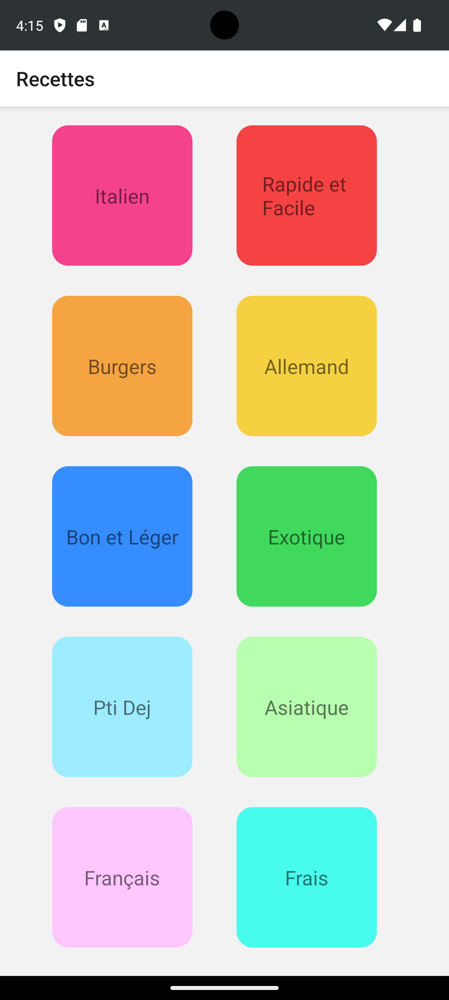
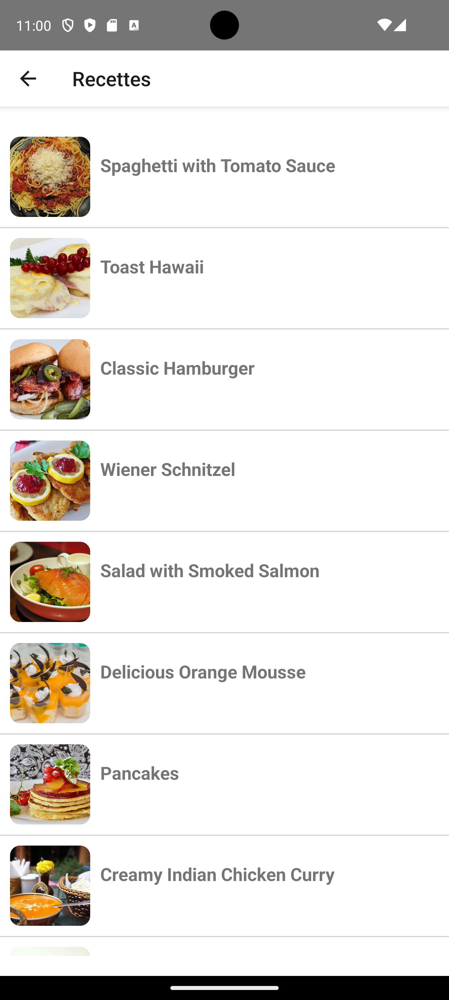
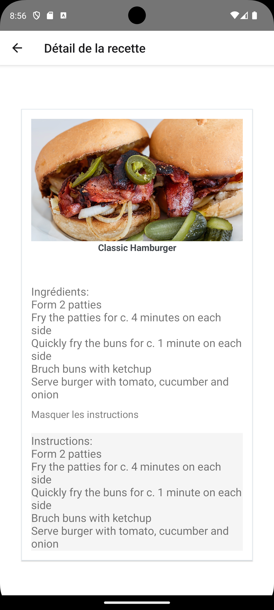

# Description de l'Application Recettes

L'application Recettes est une application mobile conçue pour aider les utilisateurs à trouver et à explorer une variété de recettes de cuisine. Avec une interface conviviale et intuitive, les utilisateurs peuvent parcourir différentes catégories de recettes, sélectionner leurs filtres préférés et accéder aux détails complets de chaque recette.

## Fonctionnalités Principales

- **Exploration des Recettes**: Les utilisateurs peuvent parcourir une large gamme de recettes organisées par catégories telles que l'italien, les burgers, les recettes rapides et faciles, etc.

- **Filtrage des Recettes**: Les utilisateurs peuvent filtrer les recettes en fonction de leurs préférences en sélectionnant différents filtres tels que le type de cuisine, la durée de préparation, etc.

- **Détails des Recettes**: En sélectionnant une recette, les utilisateurs peuvent accéder à des informations détaillées sur celle-ci, y compris la liste des ingrédients, les instructions de préparation et une image attrayante de la recette.

## Capture d'écran de l'Application

*Capture d'écran de la page d'accueil de l'application, montrant une sélection de recettes par catégorie.*

*Capture d'écran de la page de détails d'une recette, affichant une image attrayante de la recette, la liste des ingrédients et les instructions de préparation.*

*Capture d'écran de la fonction de filtrage des recettes, permettant aux utilisateurs de sélectionner des filtres spécifiques pour affiner leurs résultats de recherche.*
